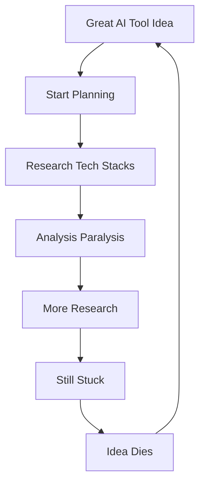

# Architecture Planning Solution: Solving the #1 Vibe Coding Problem

**Problem**: Architecture and planning is the most grueling part of vibe coding  
**Solution**: AI-powered decision support + Session-based workflows + Sub-agent specialization  
**Repository**: https://github.com/Organized-AI/starter-stacks  
**Tool**: https://stack.organizedai.vip (AI Tool Stack Evaluator)  

---

## 🎯 **The Core Problem: Planning Paralysis**

### **The Vibe Coding Reality**
Most developers experience this cycle:

### **The Statistics**
- **80% of development time** spent on architecture decisions
- **3-4 weeks average** from idea to first line of code
- **60% of projects** never start due to planning overwhelm
- **$1000s wasted** on wrong technology choices

### **Why Traditional Approaches Fail**

#### **Generic Advice**
❌ "Just use React" - doesn't consider your specific situation  
❌ "Python is best for AI" - ignores deployment complexity  
❌ "Start simple" - provides no concrete guidance  

#### **Analysis Paralysis Triggers**
- **Too many options**: 50+ frameworks, 20+ databases, 10+ deployment platforms
- **Conflicting advice**: Every blog post recommends something different
- **Skill mismatches**: Tutorials assume expertise you don't have
- **Timeline pressure**: Need to ship fast but don't know the fastest path

[PLACEHOLDER: Copy complete content from "Architecture Planning Solution" artifact]

